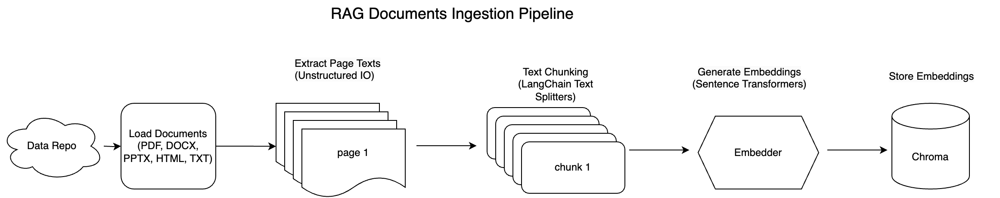

# Distributed RAG Pipeline

This project demonstrates a regular Retrieval-Augmented Generation (RAG) document ingestion and retrieval workflow in a single notebook:

- Input documents are loaded from the `documents/` folder.
- Documents are partitioned page-by-page using `unstructured`.
- Text is chunked with LangChain text splitters.
- Embeddings are generated using `intfloat/multilingual-e5-large-instruct`.
- Vectors and metadata are stored in ChromaDB.
- Similarity search returns the most relevant chunks for a query.

## Pipeline Flow

The following diagram is extracted from the notebook and shows the end-to-end flow:



## Project Structure

- `original_rag.ipynb`: Main notebook containing the full ingestion + retrieval pipeline.
- `documents/`: Source files to ingest (`.pdf`, `.docx`, `.pptx`, `.html`, `.txt`).
- `requirements.txt`: Python dependencies used by the notebook.
- `rag_pipeline_flow.png`: Flow image extracted from the notebook.

## Setup

1. Create and activate a Python virtual environment.
2. Install Python dependencies:

```bash
pip install -r requirements.txt
```

3. On macOS, install OCR/system dependencies used by `unstructured`:

```bash
brew install poppler tesseract
```

4. Open and run `original_rag.ipynb` from top to bottom.

## What the Notebook Does

1. Configures runtime environment (PATH/SSL certs) for robust document parsing.
2. Parses each input file and groups extracted text by page.
3. Applies configurable chunking (fixed or recursive).
4. Generates embeddings for all chunks.
5. Stores embeddings, text, and metadata in ChromaDB.
6. Runs semantic similarity search for a user query.
7. Reformats search results for easier inspection.

## Notes

The current files inside `documents/` are reading materials from my Human Centered Design class. These can be replaced or updated based on user choice.